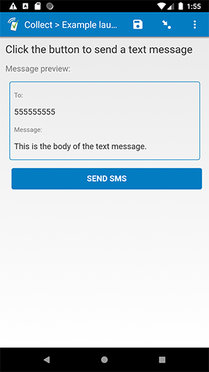

# Launch SMS

## Description

This plug-in will compose an SMS text message and launch the default SMS app. It receives a phone number and a message as parameters, and provides a button to launch the SMS app (using the number and message from the parameters).

## Features

* Supports the `text` field type, but doesn't provide an actual text input. The response that gets recorded in your form data will be based on the parameters.
* If the SMS app is successfully launched, the field's response will be stored as:  
    > The following SMS was sent to [number]: '[message]'.

## How to use

1. Download the test form [extras/test-form](https://github.com/surveycto/launch-sms/raw/master/extras/test-form/Launch%20SMS.xlsx) from this repo and upload it to your SurveyCTO server.
1. Download the [launch-sms.fieldplugin.zip](https://github.com/surveycto/launch-sms/raw/master/launch-sms.fieldplugin.zip) file from this repo, and attach it to the test form on your SurveyCTO server.
1. Make sure to provide the correct parameters (see below).

## Required parameters

| Key | Value |
| --- | --- |
| `number` | The phone number to which the SMS should be sent. |
| `message` | The body of the text message. |

*Note: it is suggested to use values stored in other fields for the parameters. Take a look at the test form to see how this is accomplished.

## More resources

* **Test form**  
[extras/test-form](https://github.com/surveycto/launch-sms/raw/master/extras/test-form/Launch%20SMS.xlsx)
* **Developer documentation**  
Instructions and resources for developing your own field plug-ins.  
[https://github.com/surveycto/Field-plug-in-resources](https://github.com/surveycto/Field-plug-in-resources)
* **User documentation**  
How to get started using field plug-ins in your SurveyCTO form.  
[https://docs.surveycto.com/02-designing-forms/03-advanced-topics/06.using-field-plug-ins.html](https://docs.surveycto.com/02-designing-forms/03-advanced-topics/06.using-field-plug-ins.html)
